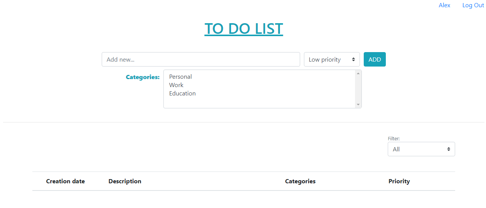
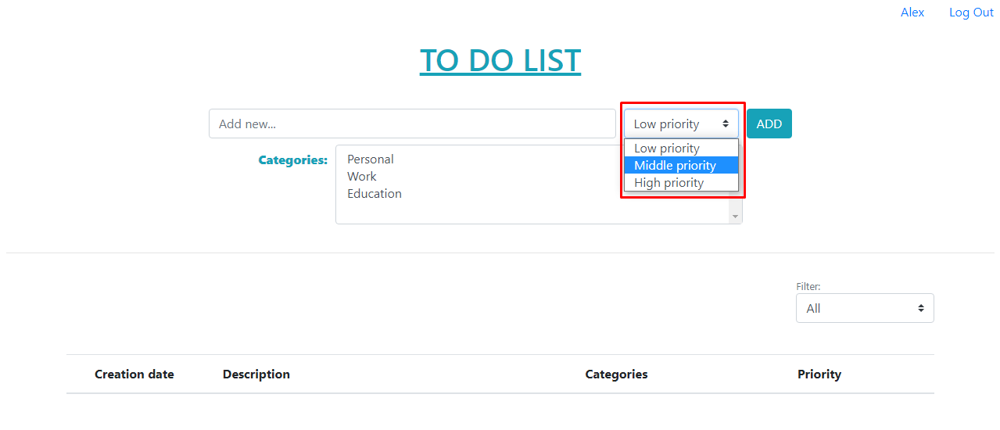
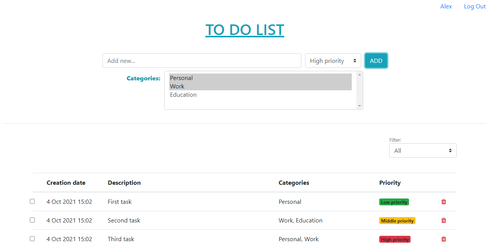
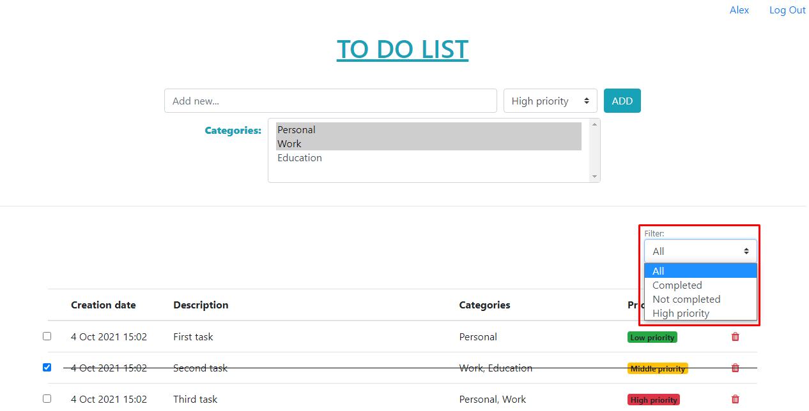

# job4j_todo

+ [Описание](#описание)
+ [Технологии](#технологии)
+ [Интерфейс](#интерфейс)
+ [Автор](#автор)

## Описание

MVC веб-приложение, представляет собой "TO-DO LIST". В этом приложении предоставляется возможность вести список дел 
по приоритету важности. Для хранения данных используется Hibernate. 

## Технологии

+ Сборщик проектов **Maven**;
+ Frontend - **HTML**, **CSS**, **BOOTSTRAP**, **JS**, **AJAX**, **JQUERY**;
+ Backend - **Java 14**, **Servlet**;
+ Для хранения данных используется фреймворк - **Hibernate**;
+ Логгирование - **Log4j**, **Slf4j**;
+ СУБД - **PostgreSQL**;
+ Контейнер сервлетов - **Apache Tomcat**;
+ Непрерывная интеграция - **Travis CI**;
+ Инструмент для анализа стиля кода - **Checkstyle**;

## Интерфейс

Начальная страница без добавленных задач выглядит так: 

Сверху страницы находится рабочее пространство для добавления новых задач. А именно описание задачи и выбор приоритета.
Снизу же пока что пустая таблица, где хранятся текущие задачи.

---

Доступные приоритеты:

---

При добавлении задачи имеется валидация. Без описания невозможно добавить задачу. Кликнув на кнопку "ADD", получим такое
уведомление:

--- 

Добавим наконец несколько задач с разными приоритетами. Все задачи сортируются по дате, по возрастанию. Свежая задача 
падает в конец списка, старые остаются висеть сверху:

---

Выполненную задачу можно отметить соответствующим чекбоксом в строке задачи. После отметки, строка с задачей будет
перечеркнута:

---

Также имеются несколько встроенных фильтров для списка задач:

---

Отфильтруем задачи, оставив невыполненные:

## Автор

Становов Семён Сергеевич

Email: sestanovov@gmail.com

Telegram: [@stanovovss](https://t.me/stanovovss)